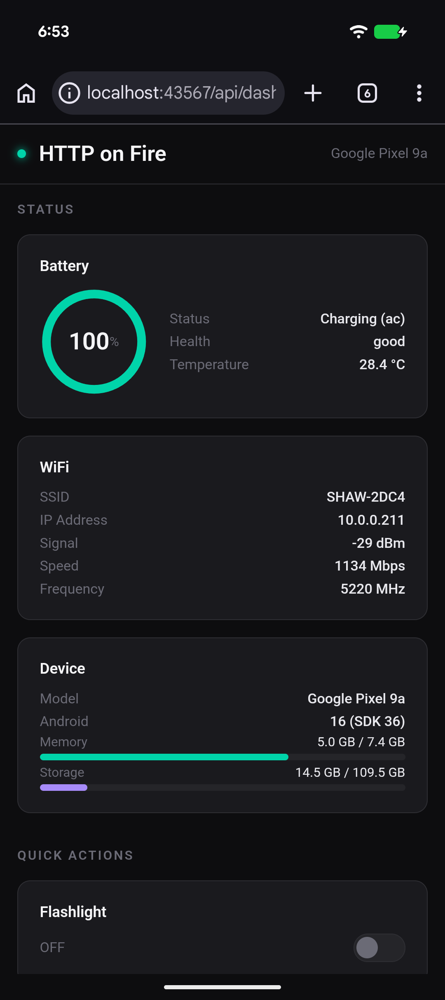
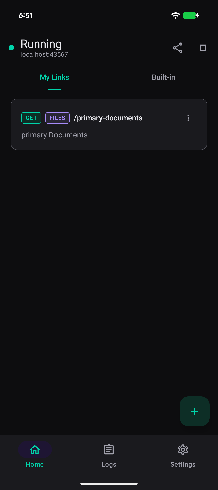
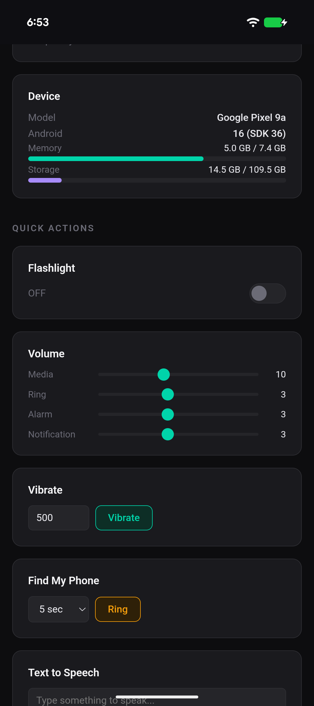
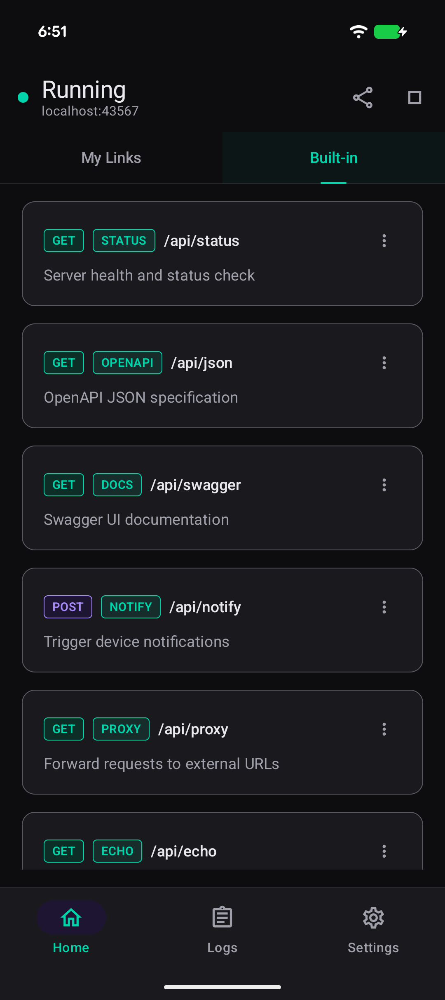
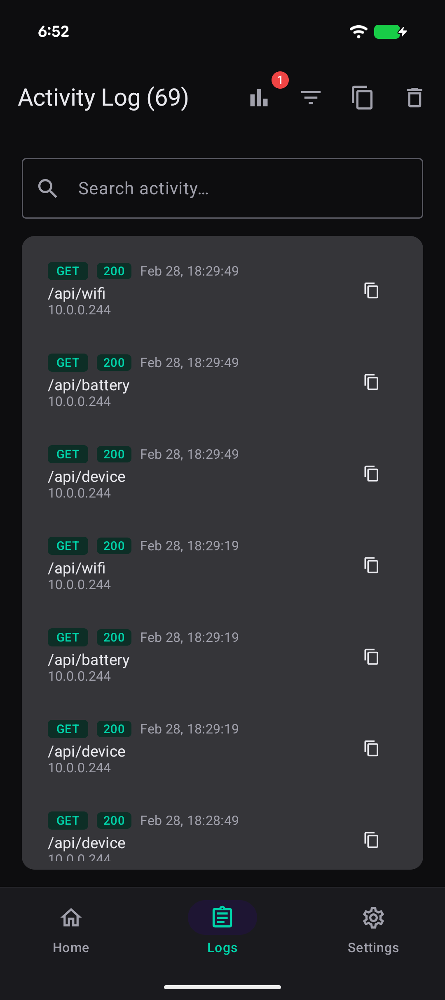
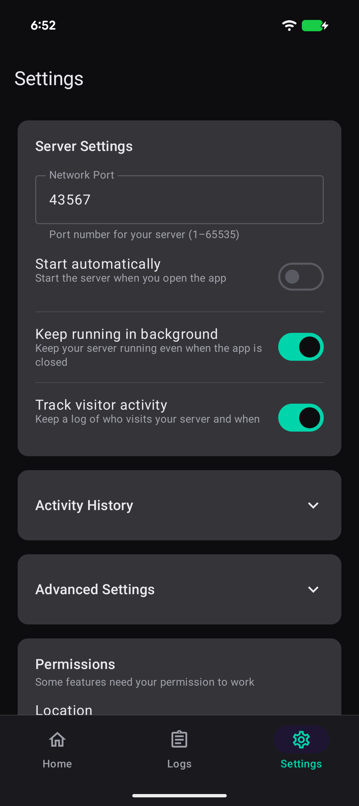

<div align="center">

# HTTP on Fire

**Turn your Android phone into a web server & remote control panel.**

<br>

[](https://github.com/zahidaz/HTTPOnFire/releases)
[](https://github.com/zahidaz/HTTPOnFire/stargazers)
[](LICENSE.txt)

[](#)
[](#)
[](#)
[](#)
[](#)
[](#)

<br>

&nbsp;&nbsp;&nbsp;&nbsp;

</div>

<br>

## What can it do?

Start the app, and your phone becomes a web server. Open a browser on your laptop, tablet, or any device on your WiFi — and you'll get a **live dashboard** to control your phone remotely. Toggle the flashlight, adjust volume, capture photos, stream the mic, check battery, find your phone by ringing it, read contacts, manage apps, send notifications... **25+ features**, all from the browser.

Want to go further? Share files, host a website, create custom API endpoints, or set up redirects — all through a simple visual builder. No coding required.

**No root. No cloud. No sign-up. Just your phone and your WiFi.**

<br>

---

<br>

## Download

<div align="center">

<a href="https://github.com/zahidaz/HTTPOnFire/releases/latest">

</a>

<br><br>

<a href="https://github.com/zahidaz/HTTPOnFire/releases">

</a>

<br>

<sub>Scan to open releases page</sub>

</div>

<br>

---

<br>

## Screenshots

<div align="center">
<table>
<tr>
<td align="center"><b>Home</b></td>
<td align="center"><b>Built-in APIs</b></td>
<td align="center"><b>Activity Log</b></td>
<td align="center"><b>Settings</b></td>
</tr>
<tr>
<td></td>
<td></td>
<td></td>
<td></td>
</tr>
</table>

<table>
<tr>
<td align="center"><b>Web Dashboard — Device Status</b></td>
<td align="center"><b>Web Dashboard — Quick Actions</b></td>
</tr>
<tr>
<td></td>
<td></td>
</tr>
</table>
</div>

<br>

---

<br>

## Features

### Remote Control

| Feature | Description |
|:--------|:------------|
| **Dashboard** | Full web control panel — manage everything from a browser |
| **Flashlight** | Toggle torch on/off |
| **Volume** | Read or set media, ring, alarm, notification levels |
| **Vibrate** | Vibrate for a custom duration |
| **Find My Phone** | Play alarm sound to locate device |
| **Text to Speech** | Speak text aloud through device speakers |
| **Clipboard** | Read or write device clipboard |
| **Camera** | Capture photo from front or back camera |
| **Microphone** | Live audio stream from device mic |
| **Notifications** | Push notifications with custom title, body, and priority |
| **Launch / Stop Apps** | Open or kill any installed app remotely |

### Device Info

| Feature | Description |
|:--------|:------------|
| **Battery** | Level, charging status, health, temperature |
| **WiFi** | SSID, IP, signal strength, speed |
| **Device** | Model, OS, memory, storage |
| **Location** | GPS coordinates, altitude, accuracy |
| **Contacts** | Names and phone numbers |
| **Installed Apps** | Full app list with versions |

### Content Hosting

| Feature | Description |
|:--------|:------------|
| **File Sharing** | Serve any file from device storage |
| **Folder Browsing** | Share folders with file explorer UI and upload support |
| **Custom Pages** | Create GET/POST/PUT/DELETE routes with custom responses |
| **Redirects** | Short URLs that forward to other destinations |
| **QR Codes** | Generate QR code images from any text |

### Developer Tools

| Feature | Description |
|:--------|:------------|
| **Swagger UI** | Interactive API documentation in the browser |
| **OpenAPI Spec** | Machine-readable API schema |
| **Echo** | Mirror back request details for debugging |
| **Proxy** | Forward requests through device to external URLs |
| **Activity Log** | Searchable request log with status codes and timestamps |

<br>

---

<br>

## Quick Start

The server runs on port **43567** by default. Replace `<phone-ip>` with your device's local IP.

```bash
# Open the dashboard
open http://<phone-ip>:43567/api/dashboard

# Toggle flashlight
curl -X POST "http://<phone-ip>:43567/api/flashlight?enable=true"

# Send a notification
curl -X POST http://<phone-ip>:43567/api/notify \
  -H "Content-Type: application/json" \
  -d '{"title":"Hello","body":"From my laptop!"}'

# Capture a photo
curl -X POST "http://<phone-ip>:43567/api/camera?facing=back" -o photo.jpg

# Listen to live microphone
open "http://<phone-ip>:43567/api/mic/stream"
```

> **Using an emulator?** Run `adb forward tcp:43567 tcp:43567` then use `localhost`.

<br>

---

<br>

## Build from Source

```bash
git clone https://github.com/zahidaz/HTTPOnFire.git
cd HTTPOnFire
./gradlew assembleDebug
```

<br>

## Contributing

Got an idea for a new device API? Found a bug? Want to improve the UI? Contributions of all kinds are welcome — open an issue or submit a pull request.

<br>

## License

```
Copyright 2025 zahidaz

Licensed under the Apache License, Version 2.0
http://www.apache.org/licenses/LICENSE-2.0
```

<div align="center">
<br>

---

<sub>Built with Kotlin, Ktor, and Jetpack Compose</sub>

</div>
